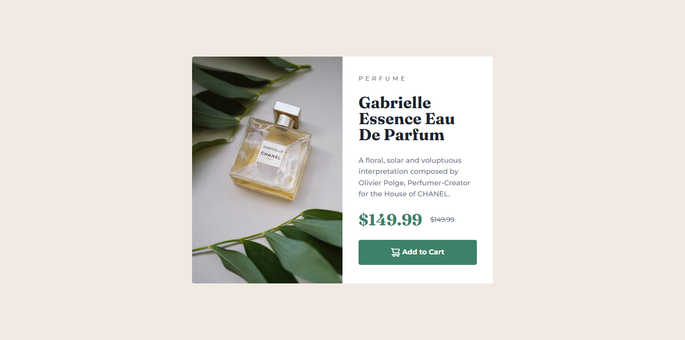

# Frontend Mentor - Recipe page solution

This is a solution to the [Product preview card component challenge on Frontend Mentor](https://www.frontendmentor.io/challenges/product-preview-card-component-GO7UmttRfa). Frontend Mentor challenges help you improve your coding skills by building realistic projects.

## Table of contents

- [Overview](#overview)
  - [The challenge](#the-challenge)
  - [Screenshot](#screenshot)
  - [Links](#links)
- [My process](#my-process)
  - [Built with](#built-with)
  - [Useful resources](#useful-resources)

## Overview

### Screenshot

### Links

- Solution URL: [Add solution URL here](https://github.com/Mohammed-Osama-pg/FdMr-Product-preview-card-component.git)
- Live Site URL: [Add live site URL here](https://mohammed-osama-pg.github.io/FdMr-Product-preview-card-component/)

## My process

### Built with

- Semantic HTML5 markup
- CSS custom properties
- Flexbox
- Mobile-first workflow
- Using SASS

### Useful resources

- [How to estimating the time of website project](https://www.youtube.com/watch?v=GbQ4K13ow3o)
- [typography css clamp](https://chriskirknielsen.com/blog/modern-fluid-typography-with-clamp/)

## How much time the project will take:

- My guess : 4 hour focus work
- The real time: 5:40 hour focus work
